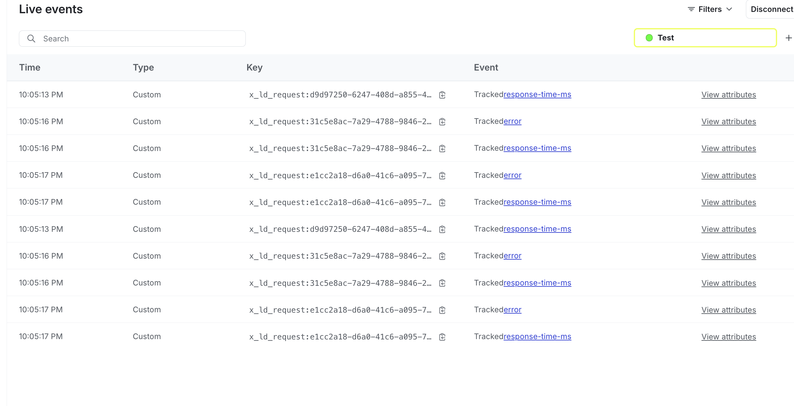

# LaunchDarkly Guard Express



This project automatically instruments express.js applications with LaunchDarkly metrics for use with guarded rollouts. 

## Features

- Automatically tracks request duration and error events
- Automatically uses the last context evaluated during the currently active request
- Uses async hooks to ensure intereleaved requests are tracked correctly
- Optional: Creates a helpful "request" context you can use for evaluation

# Usage

```javascript
import express from 'express';
import { createGuard, guardErrorHandler } from 'launchdarkly-guard-express';

const app = express();

const {
    // LaunchDarkly SDK hook that registers context tracking
    expressHook, 
    // Creates the middleware for the given SDK client instance
    guardMiddleware
} = createGuard();
// Create LD client with the context tracking hook for express
const ldClient = LaunchDarkly.init(LD_SDK_KEY, {
    hooks: [expressHook]
});

// install the middleware
app.use(guardMiddleware(ldClient));
// add your routes

// install the error tracking middleware
app.use(guardErrorHandler());
```

## Table of Contents

- [Installation](#installation)
- [Usage](#usage)
- [Configuration](#configuration)
- [Contributing](#contributing)
- [License](#license)

## Installation

To install the dependencies, run:

```bash
npm install
```

## Usage

To start the application, use:

```bash
npm start
```

## Configuration

Create a `.env` file in the root directory and add your LaunchDarkly SDK key:

```env
LD_SDK_KEY=your_launchdarkly_sdk_key
```

## Contributing

Contributions are welcome! Please open an issue or submit a pull request.

## License

This project is licensed under the MIT License. See the [LICENSE](LICENSE) file for details.
